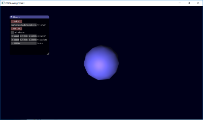
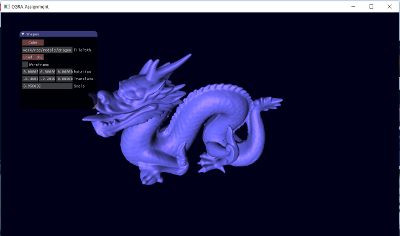

# Mesh viewer

## Description
This was created for an assignment at university to learn how to create meshes and perform transformations with number and mouse inputs.

## Installation
This project requires CMake and can be installed here (https://cmake.org/install/).

## How to run
`mkdir build`
`cd build`
`cmake ../work`
